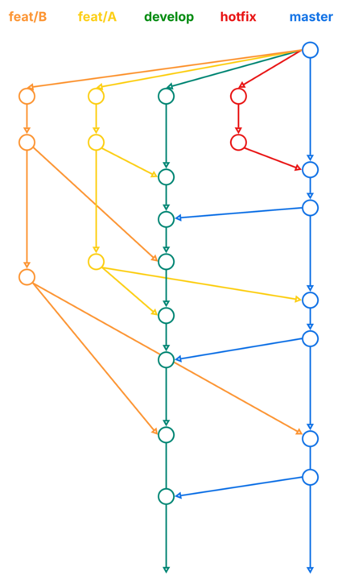

# ❏ 배경

한 프로덕트 내에서 여러 기능이 다양한 주기로 배포되는 경험을 하였다. QA를 위해 dev 환경으로 배포되는 기능과 운영을 위해 production에 나가야 하는 기능이 서로 상이하게 달랐다. 문제 상황은 정확하게 아래와 같았다.

- 프로젝트 A와 B의 기능들을 QA하고 있으나, A와 B가 동시에 배포되면 안되는 상황
- A를 QA하려고 보니, B가 배포되어 A에 대한 테스트를 하지 못하는 상황

# ❏ 문제 분석

아래의 문제가 발생하는 이유는 크게 아래의 2가지였다.

<aside>

1. 배포 파이프라인이 dev와 production 2개이고, [dev](http://dev.co.kr)-web.co.kr에서만 테스트 및 QA를 진행할 수 있다.
2. 프로젝트가 2개일 경우에 아래의 2가지 방법을 활용하였다.
    1. 두 프로젝트에 대한 모든 기능을 dev 브런치에 병합하여 [dev](http://dev.co.kr)-web.co.kr에서 배포하거나 
    2. feat/project-A 브런치를 [dev](http://dev.co.kr)-web.co.kr에 배포하여 테스트를 한다.
</aside>

`2.a)`의 경우 사용자에게 보이면 안되는 기능이 보이는 경우가 다빈도 발생하였고, `2.b)`의 경우 A를 QA하려고 보니, B가 배포되어 A에 대한 테스트를 하지 못하는 상황이 발생하였다.

> **문제의 브런치 전략**
> 

![[사진 01] 문제의 브런치 전략](./image.png)

[사진 01] 문제의 브런치 전략

# ❏ 해결책

아래와 같은 방안으로 해결할 수 있었다.

> **도메인(URL)**
> 
- `web.co.kr`: master 브런치의 최종 확인 이후, 실제 기능이 동작/운영되는 도메인
- `release-web.co.kr`: master 브런치의 기능들이 배포되는 도메인
    - 운영 직전의 최종 확인을 위해 사용하는 URL
- `dev-web.co.kr`: develop 브런치의 기능들이 배포되는 도메인
    - QA 및 테스트를 위해 사용하는 URL

> **브런치**
> 
- **master:** 운영 배포 직전의 기능이 합쳐지는 브런치 → `release-web`
- **develop:** 테스트를 위한 기능이 합쳐지는 브런치 → `dev-web`
- **hotfix:** 운영 중인 기능의 긴급한 수정이 필요할 때에 만들어지는 브런치
- **feat/A:** 프로젝트 A를 위한 기능이 개발되는 브런치
- **feat/B:** 프로젝트 B를 위한 기능이 개발되는 브런치

> **운영 방식**
> 
- 프로젝트 A,B 별 기능이 개발되는 **feat/A, feat/B** 브런치를 생성하여 각 프로젝트에 맞는 기능을 개발한다.
- 테스트를 진행할 때에는 **feat/A, feat/B** 브런치를 test에 병합하여, `dev-web.co.kr`에 배포한다.
- 프로젝트 별로 QA건이 발생할 경우, 각 프로젝트의 **feat/A, feat/B** 브런치에서 수정하여 다시 test에 병합한다.
- QA가 완료된 프로젝트의 경우 **feat/A, feat/B** 브런치를 master에 병합하여, `release-web.co.kr`에 배포한다.
- 최종 확인 이후 `web.co.kr` 에 배포하고 배포된 master 브랜치를 다시 test 브랜치에 병합한다.

> **브런치 전략 이미지**
> 

# ❏ 지식 탐색

[git branch 전략 4가지](https://www.notion.so/git-branch-4-249079e60ac38010bcdeea4c13779b5d?pvs=21)
